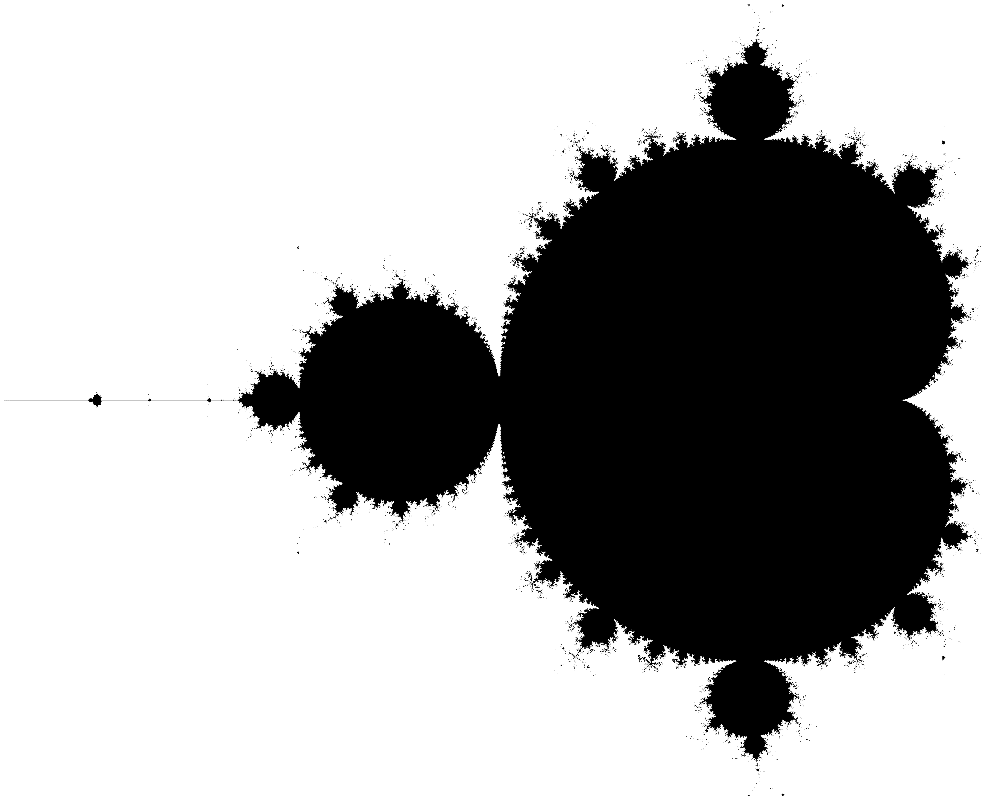
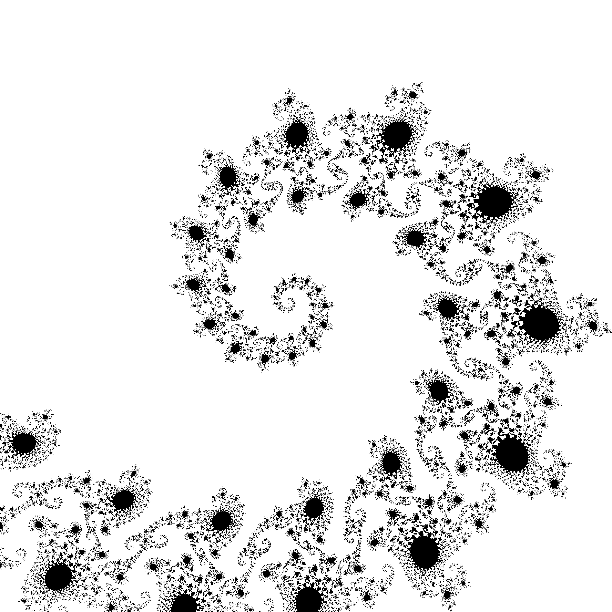
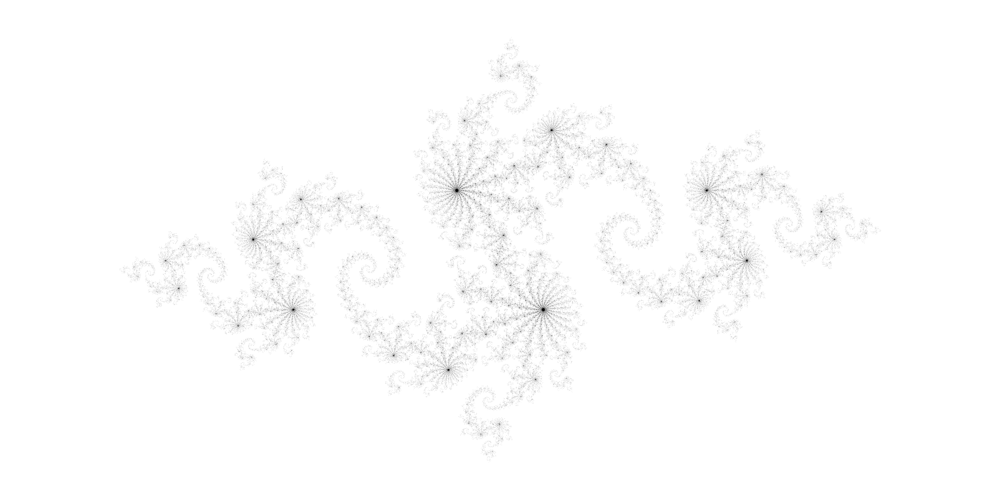
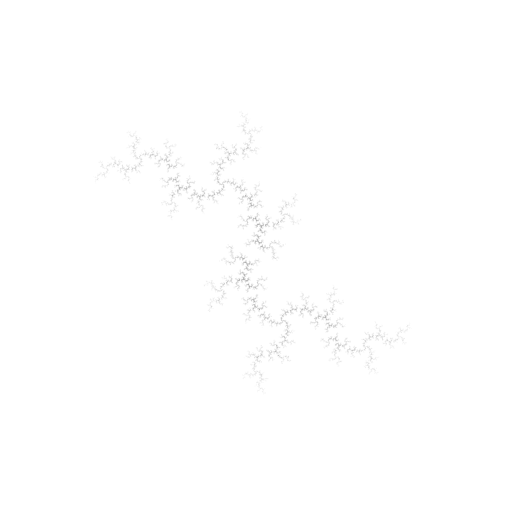

# Un projet complet

> N'oubliez pas d'indiquer les noms des membres du groupe

> A rendre avant les vacances : 28/10/2022 23:59

Dans ce TP, vous devrez créer une librairie python de A à Z. Dans ce contexte, la complexité algorithmique est modérée, l'objectif étant de démontrer votre capacité à créer un vrai paquet. 


## Présentation du problème
On va créer un générateur d'images de l'ensemble fractal de Mandelbrot. Il se définit comme suit:

> On définit l'ensemble de Mandelbrot comme l'ensemble des complexes $c\in\mathbb{C}$ tel que la suite $\{z_n\}$ ci-dessous
>$$
> \begin{cases}
> z_0=0,\\
> z_{n+1}=z_n^2+c 
> \end{cases}
>$$
>est bornée.

*Remarque: l'ensemble de Mandelbrot est contenu dans le cercle complexe de rayon 2. Inutile donc, de tester d'autres valeurs.*

D'un point de vue pratique, on se contentera de vérifier si la suite diverge après un nombre d'itérations fixé, par exemple 10, 50 ou 200, pour déterminer si le candidat $c$ est dnas l'ensemble.

On va aussi s'intéresser à l'**ensemble de Julia** qui est défini avec la même suite, mais avec $z_0\neq 0$ et $c\in \mathbb{C}$.
> Ainsi, l'ensemble de Julia pour $c$ fixé est constitué de l'assemble des $z_0\in \mathbb{C}$ pour lesquels 
> $z_{n+1}=z_n^2+c $
>converge.

En conclusion, si l'on dispose d'une fonction:
```python
def suite(z,c)-> complex:
    """Générateur des éléments de la suite $z_{n+1}=z_n^2+c$
    
    c.f. Chapitre 2"""
    while True:
        yield z
        z = z ** 2 + c
```

Alors
```python
def suite_mandelbrot(z=0,c=candidat)-> bool:
    """Renvoie la suite de Mandelbrot"""
    return suite(z,c)

def suite_julia(z=candidat,c=parametre)-> bool:
    """Renvoie la suite de julia pour candidat et parametre"""
    ...
    return suite(z,c)
```
*Remarque*: L'usage des générateurs n'est pas obligatoire pour ce TP. Il se trouve simplement que c'est l'outil le plus pertinent pour représenter la suite en python.

## Objectif du programme
On souhaite générer des visualisations des ensembles de Mandelbrot et Julia à partir d'un outil en ligne de commande. On souhaite obtenir des images de bonne résolution et il faudra donc faire attention à l'efficacité du code, même si ce n'est pas la priorité ici. En termes de performance, on se fixe l'objectif de générer une image 2000x2000 en quelques secondes.

Vous mettrez en place les structures qui vous semblent nécessaires pour atteindre les objectifs suivants.
1. Déterminer si un point du plan complexe appartient à l'ensemble de Mandelbrot.
Si un couple $(z_0,c)$ appartient à l'ensemble de Julia pour le $c$ choisi.

1. Sauvegarder une représentation graphique (image au format PNG) de l'ensemble choisit.

1. Appel en ligne de commande pour générer l'image voulue

### Exemples d'utilisation dans un script: 
```python
# Tester l'appartenance d'un point à l'ensemble de Mandelbrot:
>>> is_in_Mandelbrot(c=0.251)
True
# Dont on peut augmenter le nombre d'itérations pour les points près de la frontière
>>> is_in_Mandelbrot(c=0.251,max_iter=100)
False
# Tester l'appartenance d'un point à l'ensemble de Julia:
>>> is_in_Julia(z=0.25+0.25j,c=0.25)
True
```
Au-dessus, j'ai utilisé une expression complexe. Vous pouvez utiliser un tuple du plan réel à la place, cela n'a pas d'importance. Par contre il faudra faire attention au traitement de $j^2=-1$.

Pour les plots, on souhaite des appels de la forme suivante:
```python
# Plot de l'ensemble de Mandelbrot
>>> plot_mandelbrot()
```


```python
# Plot de l'ensemble de Mandelbrot
>>> plot_mandelbrot(zmin=-0.7440+0.1305j,
                    zmax=-0.7425+0.1320j,
                    pixel_size=5e-7,
                    max_iter=200,figname="Mandelbrot_tentacle.png")
```


```python
# Plot de l'ensemble de Julia
>>> plot_julia(c=-0.8 + 0.156j,
                zmin=-2-1j,
                zmax=2+1j,
                pixel_size=5e-4,
                max_iter=100,
                figname="Julia_-0.8+0.156j.png"))
```

### Paquetage
Une fois cette bibliothèque programmée, commenté et dument **testée**, vous empaquèterez le projet de sorte à ce que n'importe qui (en particulier le correcteur) puisse l'installer à partir des sources d'un simple 
```bash
$ cd chemin/des/sources
$ pip install .
```
Pour que le programme soit complet, les commentaires seront rédigés dans un format compatible avec `rst` pour que l'on puisse générer automatiquement la documentation avec sphynx comme vu en cours.

> *Conseil, pour la partie installation il est vivement recommandé de créer un nouvel environnement python pour vérifier que celle-ci est bien automatique.*

### Exemple d'utilisation de la bibliothèque ne CLI
Produire une par défaut de l'un des deux ensembles.
```bash
$ MandelbrotPlot -o mandelbrot.png
$ JuliaPlot -o julia.png
```

Produire une visu avec les détails choisis, comme dans l'API.
```bash
$ MandelbrotPlot --zmin=-0.7440+0.1305j\
                --zmax=-0.7425+0.1320j \
                --pixel_size=5e-7\
                --max-iter=50\
                -o "Mandelbrot_tentacle_lowiter.png" 
```


```bash
$ JuliaPlot -c=-0.8j\
            --pixel_size=1e-3\
            --max-iter=50\
            -o "thunder-julia.png" 
```


## Produire une documentation simple avec sphinx
1. Bien documenter le code.
1. Le sujet de ce TP peut servir de tutoriel.
1. La documentation de l'API peut se générer comme vue en cours.